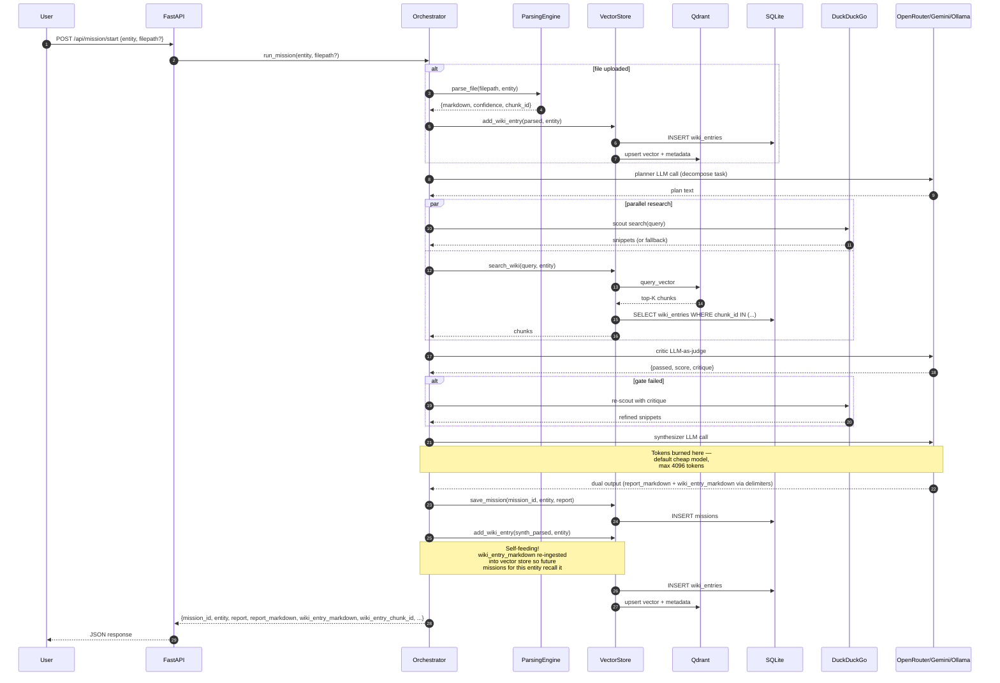
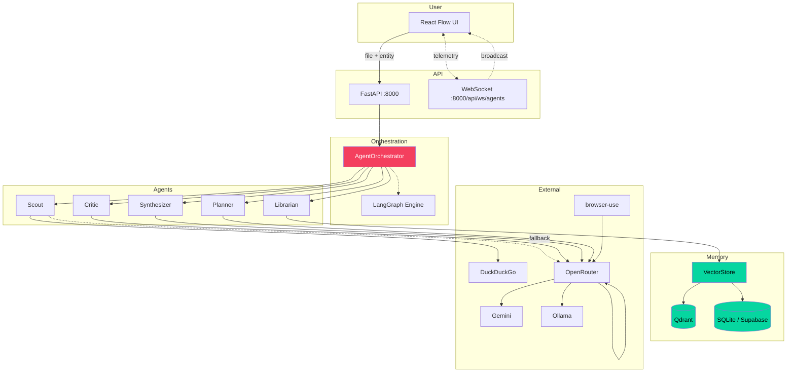

# TANGLE — Agent Communication & Flow Strategy

> **Status:** Phase 0 (live, end-to-end). This document is the strategic layer above the code — what each agent does, how they talk, where state lives, what fails, and how we keep it cheap.

---

## 1. The agent landscape

TANGLE runs **six cooperating agents** plus one orchestrator. They are not persistent processes — they are roles invoked by `AgentOrchestrator` within a single mission.

| Agent | Role | Triggered by | Inputs | Outputs |
|---|---|---|---|---|
| **Orchestrator (Maestro)** | Coordinates the mission, decides what to do next | `run_mission()` | entity_name, filepath? | emits events + final report |
| **Planner** | Decomposes the mission into 2-3 research subtasks | step 2 of mission | entity, optional file content | a plan (free text) |
| **Scout** | Web search for external facts/risks | step 3 (parallel w/ librarian) | task description | search snippets |
| **Librarian** | Vector search over the wiki for internal knowledge | step 3 (parallel w/ scout, only if file uploaded) | task + entity | wiki chunks |
| **Critic** | LLM-as-judge evaluating whether findings are sufficient | step 4 | combined findings + criteria | `{passed, score, critique}` JSON |
| **Synthesizer** | Merges findings into final markdown report + wiki-nodes JSON | step 5 | all findings + entity | final markdown |

```
                 ┌──────────────────┐
                 │   Orchestrator   │ ◄─── user /api/mission/start
                 │   (Maestro)      │
                 └────────┬─────────┘
                          │
        ┌─────────────────┼─────────────────┐
        ▼                 ▼                 ▼
   ┌─────────┐       ┌──────────┐     ┌──────────┐
   │ Planner │       │  Scout   │     │Librarian │
   └────┬────┘       └────┬─────┘     └────┬─────┘
        │                 │                 │
        │            web search        vector search
        │                 │                 │
        ▼                 ▼                 ▼
   ──────────────────────────────────────────────
                          │
                          ▼
                    ┌──────────┐
                    │  Critic  │ ──── fail? ──┐
                    └────┬─────┘             │
                         │ pass             │ retry scout
                         ▼                  │
                    ┌──────────────┐ ◄───────┘
                    │ Synthesizer  │
                    └────┬─────────┘
                         │
                         ▼
                  final markdown report
                  + ```json wiki-nodes block
```

---

## 2. Communication protocol

All agent interactions go through the **orchestrator event bus**. Currently the protocol is implicit (Python method calls); this section formalizes it.

### 2.1 Event types

Every meaningful action emits a `TelemetryEvent` (see `frontend/src/store/agentStore.ts` and `agent_orchestrator.py:_emit()`).

| `type` | Emitted by | Payload |
|---|---|---|
| `tool_call` | orchestrator (before invoking a tool) | `{tool, args, agent_id}` |
| `tool_result` | orchestrator (after tool returns) | `{tool, result (truncated 300 chars)}` |
| `agent_start` | orchestrator (before delegating) | `{agent_id, task}` |
| `agent_think` | orchestrator (before LLM call) | `{agent_id, turn}` |
| `agent_complete` | orchestrator (after LLM returns) | `{agent_id, result (truncated)}` |
| `agent_error` | orchestrator (on exception) | `{agent_id, error}` |
| `sub_delegate` | orchestrator (when one agent calls another) | `{from, to, task}` |
| `workflow_step` | orchestrator (mission-level milestone) | `{agent_id: "maestro", task}` |

### 2.2 Message schemas (proposed formal contracts)

Currently most "messages" are free-text LLM responses. The protocol we'd **like** to evolve toward:

```python
# Every agent receives a TaskEnvelope
@dataclass
class TaskEnvelope:
    mission_id: str           # ties all events for a single mission
    agent_id: str             # planner, scout, librarian, critic, synthesizer
    task: str                 # human-readable task description
    entity_name: str          # the entity being helped
    context: Dict[str, Any]   # prior findings, file content, etc.
    budget: Budget            # max_tokens, max_cost_usd, max_latency_s
    deadline: Optional[float] # unix timestamp

# Every agent returns a TaskResult
@dataclass
class TaskResult:
    agent_id: str
    status: Literal["ok", "partial", "failed"]
    content: str              # the actual finding/recommendation
    citations: List[str]      # sources used
    confidence: float         # 0.0–1.0
    tokens_used: int
    cost_usd: float
    latency_s: float
    error: Optional[str]
```

**Today:** these are dicts, not dataclasses. Most fields are missing or implicit. The dataclass version is a Phase 0.2+ target.

### 2.3 Communication patterns we use

| Pattern | Where | When to use |
|---|---|---|
| **Pipeline (sequential)** | planner → scout/librarian → critic → synthesizer | When each step depends on the previous |
| **Fan-out parallel** | scout + librarian dispatched simultaneously | When sub-tasks are independent |
| **Retry with escalation** | critic fail → re-scout with critique as new query | When quality gate fails but fixable with more info |
| **Cheap-then-premium** | vision pass-1 (cheap) → pass-2 (premium only on VITAL_INFO) | When cost discipline matters |
| **Provider fallback chain** | OpenRouter → Gemini → Ollama | When primary provider rate-limits or fails |
| **Per-mission cost tagging** | every `gateway.chat()` carries `agent_context={"mission_id": ...}` | So we can answer "what did this mission cost?" — exposed via `GET /api/missions/{id}/cost` |
| **Synthesizer dual output** | single LLM call returns both `report_markdown` and `wiki_entry_markdown` via explicit delimiters | When the synthesis output must serve both humans (report) AND the knowledge base (re-ingestable wiki entry) |

### Synthesizer dual-output contract (the dual-output pattern)

The **Synthesizer agent** is the system's last step and its output has TWO consumers: the human reading the report in the UI, and the vector store that wants to feed this knowledge back into future missions. Rather than making two LLM calls (which would double the synth cost), we ask the LLM to produce two clearly delimited blocks in one response:

```
===TANGLE_REPORT_START===
[human-readable report with executive summary, findings, actions, risks,
 ending with a ```json wiki-nodes``` code block for the radiating graph]
===TANGLE_REPORT_END===

===TANGLE_WIKI_START===
[wiki-spec body — opening paragraph, ## Findings, ## Recommended Actions,
 ## Open Questions, ### Tags — NO metadata headers, those are injected]
===TANGLE_WIKI_END===
```

Python (`AgentOrchestrator._split_synth_response`) parses both blocks via regex. The wiki body is then wrapped with deterministic metadata headers in `AgentOrchestrator._assemble_wiki_entry`:

```python
# Entity: Test Cat
# Source: tangle-synthesis-test-cat-2026-06-28.md
### Extracted: 2026-06-28T15:00:00Z
### Confidence: 0.85
### Chunk ID: <uuid>

[LLM-produced body]

### Related Chunks
- [[source-file:tangle-synthesis-test-cat-2026-06-28.md]]

### Tags
- #synthesized
```

Why metadata is Python-injected, not LLM-generated: chunk_id, timestamp, source filename, and confidence MUST be deterministic and exactly match what the orchestrator stores in SQLite + Qdrant. Letting the LLM write them risks drift between what the LLM emits and what's stored.

After synthesis, the orchestrator feeds `wiki_entry_markdown` back into `vector_store.add_wiki_entry()` — the system becomes **self-feeding**: every mission makes the next mission on the same entity slightly smarter. Confidence is derived from the critic score:
- critic verified + score ≥ 0.7 → use critic score (e.g. 0.85)
- critic verified + score < 0.7 → 0.5 (gate failed but content exists)
- critic not verified → 0.5 (explicitly unverified)

**Graceful degradation:** if the LLM doesn't honor the delimiters, the orchestrator uses the raw response for both fields (with a warning). It will never crash a mission over a missing delimiter.

### Critical quality rule: never silently "safe-pass"

The **Critic agent's gate** is the system's only quality check. If the critic errors out, we MUST NOT pretend the report passed. Current behavior (as of June 2026):

- Critic succeeds → returns `{passed, score, critique, verified: true}`
- Critic errors (timeout, JSON parse fail) → returns `{passed: false, score: 0.5, critique: "VERIFICATION FAILED: ...", verified: false}`
- The mission response includes `verified`, `critic_score`, `critic_critique`, and `usage` fields
- Downstream UI MUST render `[UNVERIFIED]` badge when `verified == false`

This is a hard rule — lying to the user about quality is worse than admitting uncertainty.

### 2.4 Patterns we should add (Phase 0.2+)

| Pattern | Why |
|---|---|
| **Streaming partial results** | Long LLM calls feel dead to the user; stream tokens as they arrive |
| **Cancellation propagation** | User hits stop; orchestrator cancels in-flight LLM requests |
| **Persistent checkpoint** | Resume a mission after crash without re-doing work |
| **Multi-entity batch** | "Help these 5 cats" → 5 missions with shared librarian context |
| **Parallel synthesis** | Multiple synth agents compete, critic picks the best |

---

## 3. State management

Where does what live? This matters for debugging, recovery, and the user's privacy/sovereignty story.

| State | Lives in | Lifetime | Owner |
|---|---|---|---|
| Raw uploaded file | `uploads/` at repo root | Until user deletes | filesystem |
| Parsed wiki chunks | SQLite `wiki_entries` + Qdrant `tangle_wiki_memories` | Until user deletes | vector_store |
| Mission reports | SQLite `missions` + (in-memory until run completes) | Permanent unless user deletes | vector_store |
| Per-mission usage (tokens, cost, call count) | in-memory dict in `FreeGateway._mission_usage`, exposed via `/api/health/usage` and `/api/missions/{id}/cost` | Session-lifetime (lost on restart) | free_gateway |
| Run history | `.tangle-history/runs.json` | Append-only log | run_history |
| Kanban state | `.tangle-kanban.json` | Mutable, last-write-wins | kanban_store |
| TASKLIST.md | repo root | Mutable, human-editable | task_manager |
| Telemetry events | in-memory during mission, broadcast via WebSocket. **Lost on page refresh** — Phase 0.1 should persist to localStorage or recover from SQLite on reconnect | Ephemeral | agentStore |
| LLM rate limits | in-memory dict in `free_gateway` | Until process restart | gateway |
| OAuth/API keys | `.env.local` (gitignored) | Until user rotates | dotenv |

### State transitions for one mission

```
1. POST /api/mission/start {entity, filepath?}
   │
   ▼
2. (optional) ingest file → vector_store.add_wiki_entry()
   │     SQLite wiki_entries ← write
   │     Qdrant tangle_wiki_memories ← upsert
   │
   ▼
3. planner → LLM call → plan (free text)
   │
   ▼
4. ┌── scout → search() → DuckDuckGo HTML scrape → snippets
   │                          ↓ fail
   │                       OpenRouter "search helper" fallback
   │
   ├── librarian → vector_store.search_wiki() → chunks
   │
   └── gather both findings
   │
   ▼
5. critic → evaluate() → LLM-as-judge → {score, critique}
   │
   ├── score >= 0.7 → continue
   │
   └── score < 0.7 → re-scout with critique → re-evaluate (1 retry)
   │
   ▼
6. synthesizer → LLM call → final markdown + ```json wiki-nodes ```
   │
   ▼
7. vector_store.save_mission(mission_id, entity, report)
   │     SQLite missions ← write
   │
   ▼
8. return {mission_id, report, wiki_entry} to client
```

---

## 4. Cost discipline

TANGLE is designed to be cheap-by-default. The principles:

- **Cheapest model that returns valid JSON wins.** Default model: `meta-llama/llama-3.3-70b-instruct:free`. Only escalate when cheap fails the eval gate.
- **One premium call beats ten retries.** If critic gate keeps failing on cheap, jump to premium once instead of retrying cheap N times.
- **Vision dual-pass: cheap ALWAYS runs first.** Pass-2 (Claude 3.5 Sonnet) only triggers when `VITAL_INFO: TRUE` is detected. Most images stop at pass-1.
- **Embeddings: OpenAI text-embedding-3-small only.** $0.02/1M tokens. **SHA256 hash fallback if no key — but this gives ZERO semantic search**, it's just a no-crash placeholder so the system stays alive offline. The orchestrator should warn the user loudly when this is active.
- **No silent re-tries on user-facing calls.** Show the user "trying Gemini instead" so they understand cost moves.
- **Provider fallback is sequential, not parallel.** OpenRouter first → Gemini → Ollama. Don't pay for parallel attempts.
- **Per-mission cost is now tracked.** Every `gateway.chat()` carries `agent_context={"mission_id": ...}`, accumulates `tokens_in/out/cost_usd/calls` per mission, exposed via `GET /api/missions/{id}/cost`. Session totals via `GET /api/health/usage`. Cost per 1M tokens is conservatively estimated at $0.20 (covers free-tier rates with margin for paid fallbacks).

### Per-agent budget (proposed, Phase 0.2+)

| Agent | Suggested model | Max tokens | Max retries |
|---|---|---|---|
| Planner | cheap (llama-3.3-70b free) | 1024 | 1 |
| Scout | cheap + DuckDuckGo (free) | 2048 | 1 |
| Librarian | cheap + vector search (free) | 2048 | 1 |
| Critic | cheap (must be reliable JSON) | 512 | 2 |
| Synthesizer | cheap (default) OR premium (if critic fails twice) | 4096 | 1 |
| Vision pass-1 | Gemini 2.0 Flash or nemotron-nano-vl free | 1024 | 1 |
| Vision pass-2 | Claude 3.5 Sonnet ONLY on VITAL_INFO | 2048 | 0 |

---

## 5. Failure modes & recovery

| Failure | What happens | Recovery |
|---|---|---|
| No LLM provider configured | All LLM calls return error | `free_gateway._fallback_to_gemini()` → Ollama |
| Qdrant down | `add_wiki_entry` falls back to `memory_vectors` list | Search degrades to SQLite LIKE query |
| Markitdown not installed | Falls back to `_fallback_parse` (text-mode read with errors="ignore") | confidence 0.5 instead of 0.9 |
| Image without gateway | Returns clear `[Image uploaded: ... AI Gateway not configured — image not analyzed]` with confidence 0.1 | User knows to install/configure provider |
| **Critic gate fails (timeout / JSON parse error)** | Returns `{passed: false, score: 0.5, verified: false, critique: "VERIFICATION FAILED: ..."}` — **does NOT silently pass** | UI shows `[UNVERIFIED]` badge on report |
| DuckDuckGo throttles HTML scrape | Falls back to OpenRouter "search helper" LLM | **⚠️ Hallucination risk** — replace with Jina AI (r.jina.ai) or SerpAPI in Phase 0.1 |
| Vector search returns 0 chunks | `query_memory` returns "No matching document entries found" | Scout alone carries the mission |
| User cancels mid-mission | `orchestrator.stop()` sets `self._running = False` | In-flight LLM calls complete; new ones not dispatched. Does NOT cancel in-flight HTTP requests yet. |
| Backend crashes mid-mission | Mission ID lost, partial state in SQLite | **No resume today** — Phase 0.2 adds checkpoint |
| WebSocket disconnects mid-mission | Telemetry events lost (in-memory) | Phase 0.1: localStorage persistence or SQLite replay on reconnect |
| **Synthesizer LLM doesn't honor dual-output delimiters** | `_split_synth_response` returns empty strings | Raw LLM response used for both `report_markdown` and `wiki_entry_markdown` body (with logger.warning). Mission completes; downstream degrades but doesn't crash. |

---

## 6. Cost & observability gaps (what we don't have yet)

Honest list of things the strategic design says we need but the code doesn't yet have:

- ✅ **Per-call cost tracking** — implemented (June 2026). `FreeGateway._mission_usage` accumulates tokens + cost per mission_id. Exposed via `/api/missions/{id}/cost` and `/api/health/usage`.
- ✅ **Never silent safe-pass** — implemented (June 2026). Critic errors return `verified: false` with explicit `VERIFICATION FAILED` critique. UI must render `[UNVERIFIED]` badge.
- ✅ **Synthesizer dual output** — implemented (June 2026). `synthesize()` returns `report_markdown` + `wiki_entry_markdown` in one LLM call via explicit delimiters. Orchestrator feeds the wiki entry back into the vector store (self-feeding knowledge base). Mission response exposes both fields.
- ❌ **Per-call latency tracking** — events have `latency: 200` hardcoded as a placeholder
- ❌ **Retry with exponential backoff** — only 1 retry on critic fail; no backoff curve
- ❌ **Streaming responses** — LLM responses are awaited whole; user sees spinner not text
- ❌ **Cancellation that reaches the LLM HTTP request** — `stop()` only stops dispatching new calls
- ❌ **Mission resume after crash** — no checkpoint persistence
- ❌ **Multi-user / auth** — single-user local; everyone shares the same SQLite
- ❌ **Audit trail for compliance** — runs.json logs telemetry but not the full message contents
- ❌ **WebSocket state survives refresh** — telemetry events lost on page reload (Phase 0.1)
- ❌ **DuckDuckGo replaced by Jina/SerpAPI** — current fallback hallucinates search results (Phase 0.1)

These are queued in `TASKLIST.md` Phase 0.1 / 0.2 / Phase 1 candidates.

---

## 7. Visual flow (current Phase 0)



---

## 8. Visual flow (target Phase 1)



---

## 9. Roadmap

| Phase | Focus | Key deliverables |
|---|---|---|
| **0.0** ✅ done | Skeleton breathes | File → parse → vectorize → report end-to-end |
| **0.1** 🔜 | Polish + observability | Retry with backoff, error boundaries, real markdown render, auto-tagging, **Image Analyst agent**, **Jina/SerpAPI replacement for DuckDuckGo**, **WebSocket localStorage persistence**, **synthesizer dual output (report + wiki entry)** |
| **0.2** 🔜 | Robustness | Mission checkpointing, streaming responses, cancellation propagation, formal dataclass messages, **SQLite → Supabase migration** |
| **1.0** 📋 | Architecture swaps | **Next.js 16.2.x** frontend (App Router, Turbopack default, Cache Components), Supabase backend, multi-user, OAuth |
| **2.0** 💭 | New capabilities | Multi-entity batches, parallel synthesis, voice input, PDF export, Agent Zero (OSINT) integration, Open Source Integrator (Open Notebook, Headroom) |

### Agents explicitly deferred (not in Phase 0)

These are recognized roles from the original grand plan that aren't wired into the current pipeline. They're documented here so future contributors don't try to "fix" their absence:

- 🔮 **Image Analyst** — separate agent role for vision-only missions (today the vision dual-pass lives inside `parsing_engine._parse_image_vision`). Wire as proper `AGENT_DEFS["image_analyst"]` in Phase 0.1.
- 🔮 **Agent Zero (OSINT / Kali-style)** — full OSINT automation with sandboxed tool execution. Defer to Phase 1+ once multi-user/auth is solved.
- 🔮 **Open Source Integrator** — Open Notebook, Headroom, and similar ingestion tools. These overlap with our `parsing_engine.py`; defer until we know which we actually need.
- 🔮 **Browser automation as a flow step** — `browser_agent.py` exists on disk but isn't invoked from `run_mission()`. Add it as an optional step the user can enable per-mission in Phase 0.2.

---

## 10. Reading order for new contributors

1. `README.md` — what TANGLE is
2. `AGENTS.md` — project conventions, file map, what NOT to do
3. This document — agent communication strategy
4. `backend/agent_orchestrator.py` — the orchestrator (read the `run_mission` method first)
5. `backend/parsing_engine.py` — file ingestion
6. `backend/vector_store.py` — storage
7. `backend/free_gateway.py` — LLM routing
8. `frontend/src/store/agentStore.ts` — frontend state
9. `frontend/src/App.tsx` — UI composition
10. `scripts/smoke_test.py` — run end-to-end and watch what happens

After this, you can read any individual component file with full context.

---

*Mantra: The world is tangled. Information is tangled. Problems are tangled. We exist to untangle.*
